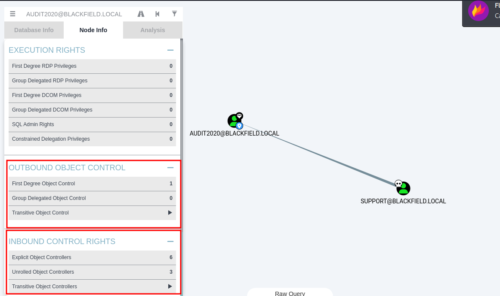
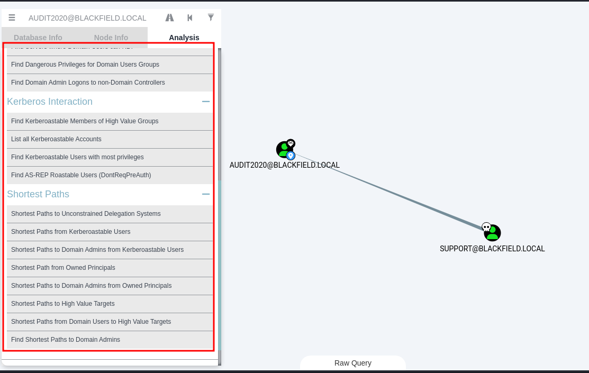
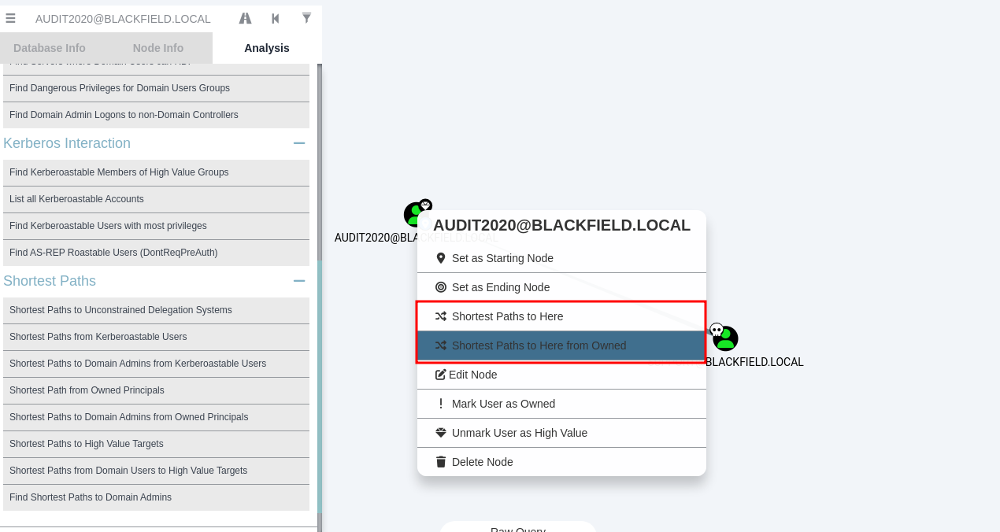

Bloodhound
========================

## Instalacao

    sudo apt update
    sudo apt install bloodhound
    sudo neo4j console
    firefox http://localhost:7474/

Nesse momento é necessário trocar a senha do usuário que vai ser acessado por meio do bloodhound. Nesse primeiro momento inforamos a credencial:
    
    neo4j
    neo4j

Já vai solicitar a troca de senha (somente da primeira vez que iniciamos o script)

Depois basta informar uma senha, (geralmente utilizo bloodhound):

Basta executar:

    bloodhound

Com usuário e senha, respectivamente:

    neo4j
    bloodhound

## Enumeracao 

Para facilitar a enumeração via ldap, podemos utilizar o bloodhound. Visto que é provável que todas as demais enumerações sejam possíveis por ldapsearch também, porém, os comandos e o protocolo detém uma complexidade um pouco maior. Deixaremos essa pesquisa para o futuro. Focando no bloodhound no momento, vamos considerar algumas opções de enumeração.

**Remotamente**

    bloodhound-python -u administrator -p Ignite@987 -ns 192.168.1.172 -d ignite.local -c All
    #Outro exemplo
    bloodhound-python -u mhope -p '4n0therD4y@n0th3r$' -d MEGABANK.LOCAL -v --zip -c All -dc MEGABANK.LOCAL -ns 10.10.10.172

**Localmente**

Aqui devemos levar em conta algumas coisas na hora de analisar. As ACLs e as permissões que nossos usuários possuem no domínio. Isto pode ser visto por meio do bloodhound da seguinte maneira:

Além de verificar os caminhos pré montados qque já fazemos:

Outra opção para ser observado seria:

Ao clicar com o botão direito no objeto, temos de procurar caminhos mais curtos para chegar neste ponto. Dessa forma, não deixamos passar nenhuma análise por meio do bloodhound.
